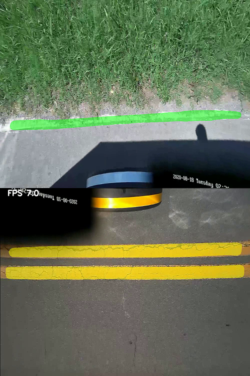

# Mask R-CNN for White & Yellow Lane Detection and Coords computation

This is an implementation of [Mask R-CNN Tensorflow 2.x](https://github.com/ahmedfgad/Mask-RCNN-TF2) for Yellow, White Lane Distance Calculation. 


The repository includes:
* [VGG VIA](https://www.robots.ox.ac.uk/~vgg/software/via/) Image Annotator
* [Mask RCNN Tensorflow 2.x](https://github.com/ahmedfgad/Mask-RCNN-TF2) 
* Pre-trained weights for MS COCO
* Mask-RCNN Lane Detection Trained weights for Inference Test
* Custom Dataset (Yellow White line) Training  

# Get Started

## Environment
Working environment : 
* [CUDA 10.1](https://developer.nvidia.com/cuda-10.1-download-archive-base) , set CUDA_PATH = programfiles_path\NVIDIA GPU Computing Toolkit\CUDA\v10.1
  
* CuDNN 7.6.5 
* Tensorflow 2.1.0 
* Keras 2.2.5.(due to compatibility issue, suggested to use internal keras module from tensorflow)

Below combination known to worked with Tensorflow 1.x : 
* [CUDA 10.0](https://developer.nvidia.com/cuda-10.0-download-archive) 
* CuDNN 7.4.x
* Tensorflow 1.15 (Tensorflow 1.18 known has issue)
* Keras 
 
## Training Preparation
In case we want to add more training image to increase accuracy or change segmentation object (ex : storm drain, arrow, pole ), just follow below step.   
1. /images/train : folder for storing training images and annotation files
2. /images/val : folder for validation images
3. Set attributes regions as bellow 


4. Image Annotation with [VGG VIA](https://www.robots.ox.ac.uk/~vgg/software/via/) tools. Open [via.html](via/via.html) on the browser to open VGG VIA locally


5. [/images/train/via_region_data.json](/images/train/via_region_data.json) : Exported annotation from VIA VGG Image Annotator


6. [runmodel.py, start_training.bat](samples/runmodel.py) In case object class num changed, inside CustomConfig & CustomDataset class , modify object class :
```bash
class CustomConfig(Config):
    ....
    NUM_CLASSES = 1 + 6  # background +  items


class CustomDataset(utils.Dataset):
    def load_custom(self, dataset_dir, subset):
        self.add_class("name", 1, "grass")
        self.add_class("name", 2, "yellow_line")
        self.add_class("name", 3, "white_line")
        self.add_class("name", 4, "road")
        self.add_class("name", 5, "scrub")
        self.add_class("name", 6, "fence") # must be same with NUM_CLASSES
```

## Run Training and output weight file

* [runmodel.py, start_training.bat](start_training.bat),  start_training.bat is batch file that invoke runmodel.py and address train image older 
* on Windows command prompt type below: 
    ```bash
    start_training
    ``` 
    or
    ```bash
    python runmodel.py train --dataset=ROOT_MaskRCNN_folder\images --weights=coco 
    ``` 
*  [/logs](/logs) : folder that stored training weight file result. 

## Inference

* Copy result weight file `/logs/mask_rcnn_name_030.h5` to root directory  
* Configure [samples/main.py](samples/main.py) 
```
ROOT_DIR_STR = "F:/MaskRCNN_folder"  #define root folder here
...
WEIGHTS_PATH = os.path.join(ROOT_DIR, "mask_rcnn_name_030.h5")  # trained weight file from/logs/mask_rcnn_name_030.h5
```


# Step by Step Detection

## 1. Create ROI through MaskRCNN segmentation on White Line and Yellow Line 
Do image segmentation on White and Yellow line. Define the masked area as ROI. Green mask is white line ROI.
Yellow mask is yellow line ROI.
This masked area will be  input to next line detection. 


## 2. Horizontal Geometry and Hough Lines on ROI
Implement HoughLinesP on ROI


## 3.  Horizontal Filtering  , Compute  Euclidian Distance


